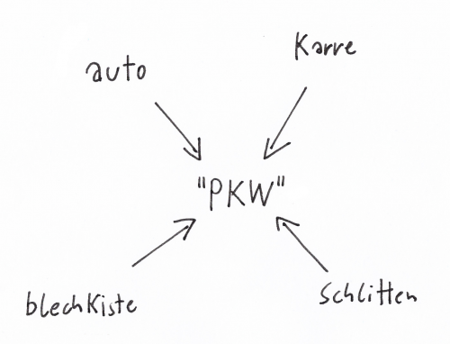

# Der interaktive Modus (Lua)


<!-- mtoc-start -->

* [REPL starten](#repl-starten)
* [Erste Schritte](#erste-schritte)
* [Rechnen](#rechnen)
* [Automatische Ausgabe des letzten Ergebnisses](#automatische-ausgabe-des-letzten-ergebnisses)
* [Variablen](#variablen)
  * [Regeln für Variablen](#regeln-fuer-variablen)
* [Zeichenketten](#zeichenketten)
  * [Mehrere Variablen für denselben Wert](#mehrere-variablen-fuer-denselben-wert)
* [Zeichenketten zusammenbauen](#zeichenketten-zusammenbauen)
* [Datentypen](#datentypen)
* [Der spezielle Datentyp `nil`](#der-spezielle-datentyp-nil)
* [Aufgabe 1.1](#aufgabe-11)
* [Aufgabe 1.2](#aufgabe-12)
* [Aufgabe 1.3](#aufgabe-13)
* [Was wir hier ausgelassen haben](#was-wir-hier-ausgelassen-haben)
  * [Der Gültigkeitsbereich von Variablen](#der-gueltigkeitsbereich-von-variablen)
  * [`io.write()` statt `print()`](#iowrite-statt-print)

<!-- mtoc-end -->

Lua ist eine interpretierte Programmiersprache. Der Lua-Interpreter ist dafür
zuständig, die Codebefehle umzusetzen – etwa, um zwei Zahlen zu addieren oder
eine Nachricht auszugeben. Diese Befehle können in einer Textdatei stehen.

Es besteht aber auch die Möglichkeit, direkt mit dem Interpreter zu
kommunizieren wie in einem Chat: Ihr gebt eine Codezeile ein, drückt Enter und
erhaltet das Ergebnis. Diese Arbeitsweise nennen wir den **interaktiven
Modus**. In der ersten Lektion werden wir ausschließlich den interaktiven Modus
verwenden.

---

## REPL starten

Mit einem Klick in das Fenster startet ihr den Lua-Interpreter und landet auf
der Konsole. Dort tippt ihr Lua-Befehle ein, bestätigt diese mit Enter und
erhaltet postwendend das Ergebnis.

---

## Erste Schritte

Für alle hier wiedergegebenen Beispiele aus interaktiven Sitzungen gilt:

- Zeilen, die mit `>` beginnen, sind **Eingaben**.
- Die anderen Zeilen sind **Antworten** des Lua-Interpreters.

---

## Rechnen

Selbstverständlich beherrscht Lua die Grundrechenarten. Schaut euch die
folgenden Beispiele an, probiert sie aus und versucht auch eigene Aufgaben.

Ihr seht an den folgenden Beispielen: Lua kennt negative Zahlen, und es
erkennt, ob eine Zahl durch eine andere ohne Rest teilbar ist (`28 / 7` ist
`4`) oder dies nicht möglich ist (`10 / 3` ist `3.3333333333333`). Lua
verwendet einen Dezimalpunkt, kein Komma.

```text
> 1 + 1
2

> 10 - 3
7

> 10 - 20
-10

> 7 * 8
56

> 28 / 7
4

> 10 / 3
3.3333333333333

> 3.141 * 2
6.282
```

Übrigens: Ihr könnt die Leerzeichen vor und nach den Rechenoperatoren (`+`,
`-`, `*`, `/`) auch weglassen, also `1+1` statt `1 + 1` schreiben. Üblicher ist
aber die Variante mit Leerzeichen, weil sie meist besser lesbar ist.

---

## Automatische Ausgabe des letzten Ergebnisses

Im interaktiven Modus gibt der Lua-Interpreter immer das Ergebnis der letzten
Eingabe automatisch aus. Bei der Ausführung von Code im Editor läuft das anders:
Dann erledigt die Funktion `print()` die Ausgabe.

Ihr könnt `print()` auch im interaktiven Modus nutzen:

```text
> print(10)
10

> print(1 + 1)
2
```

---

## Variablen

Anstatt mit Zahlen kann Lua auch mit Variablenn rechnen:

```text
> a = 1
> b = 2
> a + b
3
```

Variablen sind Platzhalter für Werte. Genauer: Variablen **verweisen** auf
Werte. Im letzten Beispiel steht `a` für den Wert `1` und `b` für den Wert `2`.

Wann immer im Code ein Wert stehen könnte – zum Beispiel eine Zahl in einer
Addition – dürft ihr auch eine Variable hinschreiben, welche auf einen Wert
verweist.

### Regeln für Variablen

- Variablen dürfen aus Buchstaben, Ziffern und Unterstrichen bestehen
- Sie dürfen **nicht** mit einer Ziffer beginnen
- Üblich sind Kleinbuchstaben und Unterstriche: lieber `anzahl_raumschiffe` statt `AnzahlRaumschiffe`

Wenn wir einen Variablen mit einem Wert verbinden (z. B. `a = 1`), heißt das
**Zuweisung**. Wenn wir einer Variablen zum ersten Mal einen Wert geben, wird dies 
**Initialisierung** genannt.

Alle innerhalb einer interaktiven Lua-Sitzung getroffenen Zuweisungen sind bis
zum Ende der Sitzung gültig. 

---

## Zeichenketten

Wenn ihr in Lua Zeichenketten (Text) eingeben wollt, müsst ihr diese mit
einfachen oder doppelten Anführungszeichen umschließen:

```text
> "Lua find ich gut"
Lua find ich gut

> 'Heute ist ein schöner Tag'
Heute ist ein schöner Tag
```

Wenn ihr einfache Anführungszeichen verwendet, darf die Zeichenkette selbst
auch doppelte enthalten – und umgekehrt:

```text
> '"Lua" ist das portugiesische Wort für "Mond".'
"Lua" ist das portugiesische Wort für "Mond".

> "'Zeichenketten' werden auch 'Strings' genannt."
'Zeichenketten' werden auch 'Strings' genannt.
```

### Mehrere Variablen für denselben Wert

Es gibt viele Dinge, die mit verschiedenen Wörtern bezeichnet werden. Zum
Beispiel nennen wir einen PKW auch Schlitten, Blechkiste, Auto oder Karre. Das
lässt sich in Lua so abbilden:

```text
> schlitten = "PKW"
> blechkiste = "PKW"
> auto = "PKW"
> karre = "PKW"

> schlitten
PKW
> blechkiste
PKW
> auto
PKW
> karre
PKW
```

Wichtig: Variablen sind **keine Behälter**, die Werte enthalten. Variablen
**verweisen** auf Werte. Dieser Unterschied wird später noch wesentlich, wenn
es um Werte geht, welche ihren Zustand ändern können.



---

## Zeichenketten zusammenbauen

In Lua ist `..` ein Operator, ähnlich wie `+`, `-` oder `*`. Mit diesem könnt ihr
Zeichenketten verknüpfen:

```text
> name1 = "Anna"
> name2 = "Peter"
> name1 .. " und " .. name2
Anna und Peter
```

`name1 .. " und " .. name2` liefert eine **neue** Zeichenkette. Einen
Codeabschnitt, welcher einen neuen Wert liefert, dieser wird in der Informatik
**Ausdruck** genannt.

Mittels `..` lassen sich auch Zeichenketten mit Zahlen verbinden. Das ist
praktisch, wenn das Programm einen Wert in verständlicher Form ausgeben soll:

```text
> temperatur = 18
> "Die Temperatur beträgt " .. temperatur .. " Grad Celsius."
Die Temperatur beträgt 18 Grad Celsius.
```

---

## Datentypen

Computer speichern letztlich nur Nullen und Einsen. Woher soll der Computer
wissen, ob eine Folge von Nullen und Einsen eine Zahl, eine Zeichenkette oder
etwas anderes ist? Das sagen ihm die sogenannten **Datentypen**.

Die Funktion `type()` verrät den Typen eines Wertes. Zeichenketten und Zahlen
habt ihr bereits kennengelernt. Die entsprechenden Typen heißen `string` und
`number`:

```text
> type("hallo")
string
> type(3.14)
number
```

In Lua sind auch Funktionen Werte. Diese haben den Typ `function`:

```text
> type(print)
function
> type(type)
function
```

---

## Der spezielle Datentyp `nil`

Wenn ihr eine Variable verwendet, welcher kein Wert zugewiesen wurde (also der
auf keinen Wert zeigt), dann hat dieser den Wert `nil`. Die Bezeichnung `nil`
kommt von dem lateinischen „nihil“ und bedeutet „Nichts“. `nil` ist auch ein
Datentyp!

```text
> print(x)
nil
> type(x)
nil
```

Ihr könnt einem Variablen auch den Wert `nil` zuweisen und somit die vorherige
Zuweisung „löschen“:

```text
> x = 10
> print(x)
10
> x = nil
> print(x)
nil
```

Ihr habt bis jetzt folgende Datentypen kennengelernt:

- `string`
- `number`
- `function`
- `nil`

In den nächsten Lektionen werden wir noch folgende Datentypen vorstellen:

- `boolean`
- `table`

---

## Aufgabe 1.1

Stell Dir vor, Du möchtest Bonbons verkaufen. Du weißt, wie viele Bonbons Du
verkaufen willst und wie viel ein Bonbon kostet. Daraus möchtest Du den
Gesamtpreis berechnen.

Speichere dafür eine ganze Zahl (zum Beispiel `7`) unter dem Variablen
`anzahl_bonbons` und eine weitere Zahl (wie `0.19`) unter dem Variablen
`stueckpreis`. Berechne den Gesamtpreis und speichere ihn unter dem Variablen
`gesamtpreis`. Gib das Ergebnis aus.

<details>
<summary>▽ Lösung</summary>

```text
> anzahl_bonbons = 7
> stueckpreis = 0.19
> gesamtpreis = anzahl_bonbons * stueckpreis
> print(gesamtpreis)
1.33
```

</details>

---

## Aufgabe 1.2

Gib der Variablen `anzahl_bonbons` einen neuen Wert (zum Beispiel `9`) und
berechne den Gesamtpreis erneut und gib diesen aus.

<details>
<summary>▽ Lösung</summary>
> anzahl_bonbons = 9
> gesamtpreis = anzahl_bonbons * stueckpreis
> print(gesamtpreis)
1.71
</details>

---

## Aufgabe 1.3

Gib den Gesamtpreis in einer schöneren Form aus:

```text
9 Bonbons kosten 1.71 Euro.
```

Du kannst hierfür Zeichenketten und Zahlen mit `..` verbinden.

<details>
<summary>▽ Lösung</summary>
> print(anzahl_bonbons .. " Bonbons kosten " .. gesamtpreis .. " Euro.")
9 Bonbons kosten 1.71 €.
</details>

---

## Was wir hier ausgelassen haben

Diese Lektion versteht sich als Rundgang durch die Sprache Lua. Vieles können wir
daher nicht eingehend behandeln, liefern aber am Ende einer jeden Lektion
Nachschlag und skizzieren ein paar weitere Themen.

### Der Gültigkeitsbereich von Variablen

Die Variablen, so wie wir sie in allen Beispielen dieses Kurses verwenden, sind
global gültig. Das bedeutet, dass sie an jeder Stelle des Programms sichtbar
sind. Das ist für die kleinen Programmbeispiele in diesem Kurs kein Problem.

Bei größeren Projekten ist globale Sichtbarkeit ein No-Go. Stellt euch vor,
sämtlicher Funkverkehr von Feuerwehr, Rettungsdiensten und Polizei einer
Großstadt würde über den selben Kanal gehen. Ein ähnliches Chaos wird in einem
großen Programm passieren, in dem alle Variablen global sind.

Das Schlüsselwort `local` vor der Initialisierung eines Variablens sorgt für
**lokale** Gültigkeit:

```lua
local temperatur = 18
```

### `io.write()` statt `print()`

Die Funktion `print()` springt nach der Ausgabe immer auf eine neue Zeile. Wenn
ihr wollt, dass das nicht passiert, verwendet die Funktion `io.write()`.

Damit lassen sich zum Beispiel schönere Dialoge und ASCII-Grafiken bauen.
Nebenbei bemerkt lassen sich mit `io.write()` auch Textdateien schreiben (wenn
man den Ausgabestrom von der Konsole auf eine Datei umlenkt). Ebenso könnt ihr
`io.read()` zum Lesen einer Datei verwenden. Dieses Thema hat in dieser
Einführung keinen Platz gefunden.
