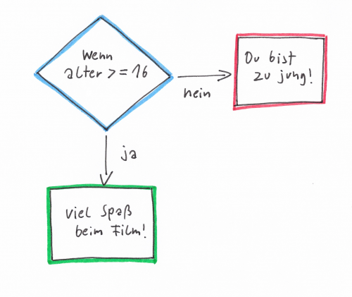
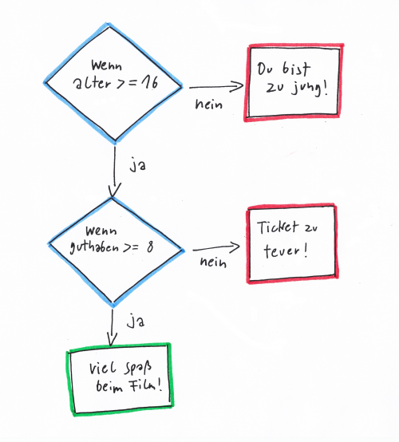

# Text eingeben, Zahlen umwandeln und Bedingungen (Lua)


<!-- mtoc-start -->

* [Text eingeben](#text-eingeben)
* [Strings in Zahlen umwandeln](#strings-in-zahlen-umwandeln)
* [Aufgabe 1](#aufgabe-1)
* [Bedingungen](#bedingungen)
* [Vergleichsoperatoren](#vergleichsoperatoren)
* [Zuweisung oder Vergleich](#zuweisung-oder-vergleich)
* [Ein paar Fingerübungen mit Vergleichsoperatoren](#ein-paar-fingeruebungen-mit-vergleichsoperatoren)
* [Bedingte Ausführung mit `if` und `else`](#bedingte-ausfuehrung-mit-if-und-else)
* [Aufgabe 2](#aufgabe-2)
* [Verschachtelte `if`-Anweisungen](#verschachtelte-if-anweisungen)
* [Aufgabe 3](#aufgabe-3)
* [Logische Operatoren](#logische-operatoren)
* [Aufgabe 4](#aufgabe-4)
* [Aufgabe 5](#aufgabe-5)
* [Aufgabe 6](#aufgabe-6)
* [Was wir hier ausgelassen haben](#was-wir-hier-ausgelassen-haben)

<!-- mtoc-end -->

## Text eingeben

Selbstverständlich ist es auch möglich, Eingaben von Nutzerinnen zu
verarbeiten. Das erledigt die Funktion `io.read()`. Diese liefert einen
Rückgabewert, welchen ihr zur weiteren Verarbeitung unter einer Variablen
speichern könnt.

Das passiert auch in dem folgenden Programmbeispiel. Es fragt nach einen Namen.
Die Eingabe wird hier der Variable `name` zugewiesen.
Die letzte Zeile verwendet `name`, um eine „persönliche“ Begrüßung
auszugeben.

```lua
print("Wie heißt Du?")
name = io.read()
print("Hallo " .. name .. "!")
```

Wenn ihr das Programm startet, dann sieht die Interaktion mit dem Programm auf
der Konsole aus wie folgt. Das Zeichen `>` verwenden wir, um Eingaben zu
kennzeichnen. 

```text
Wie heißt Du?
> Theodor
Hallo Theodor!
```

---

## Strings in Zahlen umwandeln

Was ist, wenn Nutzer einen Zahlenwert eingeben sollen? Dann gibt es eine
Besonderheit: Eingaben sind zunächst immer vom Typ `string`. Woher soll das
Programm wissen, ob in diesem Fall ein Text oder eine Zahl gemeint ist?

Hier hilft die Funktion `tonumber()`. Diese wandelt – wenn es möglich ist –
einen String in einen Zahlenwert um. Das demonstriert das nächste
Beispielprogramm. Es fragt nach der Eingabe zweier Zahlen und bildet
anschließend die Summe. Ohne die Umwandlung der Eingaben per `tonumber()` würde
die Addition `summe = zahl1 + zahl2` nicht funktionieren.

```lua
print("Bitte gib die erste Zahl ein.")
eingabe = io.read()
zahl1 = tonumber(eingabe)

print("Bitte gib die zweite Zahl ein.")
eingabe = io.read()
zahl2 = tonumber(eingabe)

summe = zahl1 + zahl2
print(zahl1 .. " + " .. zahl2 .. " = " .. summe)
```

Das Programm in einem Anwendungsbeispiel:

```text
Bitte gib die erste Zahl ein.
> 7
Bitte gib die zweite Zahl ein.
> 9
7 + 9 = 16
```

Wenn ihr in dem Programm etwas eingebt, was sich nicht in eine Zahl umwandeln
lässt (z. B. „sieben“ oder „Käse“), dann bekommt ihr eine Fehlermeldung:

```text
attempt to perform arithmetic on a nil value (global 'zahl1')
```

Das bedeutet: „Der Versuch, eine Rechnung mit `zahl1` durchzuführen, hat nicht
geklappt, weil `zahl1` gleich `nil` ist“. Das liegt daran, dass `tonumber()`,
wenn sie keinen Zahlenwert ermitteln konnte, `nil` zurückliefert.

---


## Aufgabe 1

Schreib ein Programm, dass zunächst danach fragt, wie viele Bonbons gekauft
werden sollen; als zweites soll es fragen, wie viel ein Bonbon kostet. Danach
soll das Programm den Gesamtpreis ausgeben:

```text
Wie viele Bonbons sollen es sein?
> 9
Was kostet ein Bonbon?
> 0.12
9 Bonbons kosten 1.08 Euro
```

<details>
<summary>▽ Lösung</summary>

```lua
print("Wie viele Bonbons sollen es sein?")
eingabe = io.read()
anzahl_bonbons = tonumber(eingabe)

print("Was kostet ein Bonbon?")
eingabe = io.read()
stueckpreis = tonumber(eingabe)

gesamtpreis = anzahl_bonbons * stueckpreis
print(anzahl_bonbons .. " Bonbons kosten " .. gesamtpreis .. " Euro.")
```

</details>


---

## Bedingungen

Unverzichtbarer Bestandteil eines jeden Computerprogramms sind die sogenannten
Bedingungen. Wir sprechen auch von **bedingter Ausführung**. Das heißt, dass
eine bestimmte Anweisungen nur ausgeführt werden soll, wenn eine bestimmte
Bedingung erfüllt ist.

Beispiele für bedingte Ausführungen sind:

- **WENN** der böse Geist die Spielerin berührt, **DANN** ziehe der Spielerin 100
Gesundheitspunkte ab
- **WENN** das Spiel vorbei ist, **DANN** zeige den Schriftzug `GAME OVER` an

---

## Vergleichsoperatoren

In Lua werden diese Bedingungen in sogenannten **booleschen Ausdrücken** beschrieben.
Diese Ausdrücke liefern einen Wert vom Typ `boolean`. Da Bedingungen entweder
wahr oder falsch sein können, kann dieser Wert nur zwei Zustände annehmen:
`true` (wahr) oder `false` (falsch).

Boolesche Ausdrücke enthalten oft Vergleichsoperatoren:

- `a == b`  → a ist gleich b
- `a ~= b`  → a ist nicht gleich b
- `a <  b`  → a ist kleiner b
- `a <= b`  → a ist kleiner oder gleich b
- `a >  b`  → a ist größer b
- `a >= b`  → a ist größer oder gleich b

---

## Zuweisung oder Vergleich

In Lua (und vielen anderen Programmiersprachen) steht das einfache
Gleichheitszeichen für eine **Zuweisung**:

```lua
a = 10
```

Das bedeutet: „Weise `a` den Wert `10` zu“.

In der Mathematik steht das einfache Gleichheitszeichen für einen **Vergleich**:

> `a = 10` bedeutet hier: „a hat den Wert 10“ (eine Aussage, die wahr oder
> falsch sein kann).

Wenn wir in Lua einen Vergleich machen wollen, verwenden wir das doppelte
Gleichheitszeichen:

```lua
a == 10
```

---

## Ein paar Fingerübungen mit Vergleichsoperatoren

Probieren wir ein paar Ausdrücke mit Vergleichsoperatoren aus. 

```lua
print(7 == 8)
print(7 == 7)
print(10 > 20)
print(10 > 9)
```

Selbstverständlich lassen sich auch Variablen vergleichen:

```lua
a = 1
b = 2
print(a > b)
print(a < b)
```

Auch die Ergebnisse von booleschen Ausdrücken lassen sich unter Variablenn
speichern:

```lua
bedingung = 10 == 10
print(type(bedingung))
```

---

## Bedingte Ausführung mit `if` und `else`

Das folgende Programm zeigt ein einfaches Beispiel für die bedingte Ausführung.
Es simuliert die Eingangskontrolle eines Kinos und fragt zunächst nach dem
Alter der Nutzerin. Der Film ist ab 16 Jahren zugelassen. Das bedeutet: Wenn
(`if`) das Alter größer oder gleich 16 ist (`alter >= altersbeschraenkung`),
dann (`then`) darf die Nutzerin den Film sehen.

```lua
altersbeschraenkung = 16

print("Wie alt bist Du?")
eingabe = io.read()
alter = tonumber(eingabe)

if alter >= altersbeschraenkung then
  print("Du bist alt genug für den Film: Viel Spaß!")
end
```

Die Einrückung ist übrigens nicht notwendig, erleichtert aber die Lesbarkeit.
Zusammengehöriger Code steht auf derselben Einrückungsebene.

Der eingerückte Code zwischen `then` und `end` wird auch als **Block**
bezeichnet.

Wir können das Programm erweitern, indem wir festlegen, was passieren soll,
wenn die Bedingung `alter >= altersbeschraenkung` nicht erfüllt ist. Das
passiert mit einem `else`-Zweig („sonst“):

```lua
if alter >= altersbeschraenkung then
  print("Du bist alt genug für den Film: Viel Spaß!")
else
  print("Du bist nicht alt genug, um den Film zu schauen.")
end
```

Hinweis: `if`, `else` und `end` sind **Schlüsselwörter** und dürfen nicht als
Variablen verwendet werden.



---

## Aufgabe 2

Schreib ein Programm, das eine Rechenaufgabe stellt. Wenn der Nutzer die
richtige Lösung eingibt, soll das Programm „Richtig!“ ausgeben, sonst „Leider
falsch“.

Tipp: Du kannst als Vorlage das vorherige Programmbeispiel mit der
Einlasskontrolle nutzen und musst lediglich einige Änderungen vornehmen.

<details>
<summary>▽ Lösung</summary>

```lua
print("Wieviel ist Sieben mal Acht?")
eingabe = io.read()
loesung = tonumber(eingabe)

if loesung == 56 then
  print("Richtig!")
else
  print("Leider falsch.")
end
```

</details>

---

## Verschachtelte `if`-Anweisungen

Ihr könnt auch mehrere `if`-Anweisungen ineinander verschachteln. Stellt euch
vor, dass zum Betreten des Kinos eine zweite Bedingung erfüllt sein muss,
nämlich, dass der Spieler genügend Geld für eine Karte dabei hat.

Hier vertraut die Einlasskontrolle nicht mehr auf die Ehrlichkeit der Spieler,
sondern setzt `alter` und `guthaben` direkt fest. Um die korrekte Funktion des
Programms in unterschiedlichen Situationen zu prüfen, müsst ihr verschiedene
Werte für `alter` und `guthaben` einsetzen.

```lua
altersbeschraenkung = 16
eintrittspreis = 8
alter = 17
guthaben = 3

if alter >= altersbeschraenkung then
  if guthaben >= eintrittspreis then
    print("Du bist alt genug und kannst Dir die Karte leisten: Viel Spaß!")
  else
    print("Du hast leider nicht genügend Geld für eine Eintrittskarte.")
  end
else
  print("Du bist nicht alt genug, um den Film zu schauen.")
end
```



---

## Aufgabe 3

Erweitere das letzte Codebeispiel: Der Eintrittspreis soll vom Guthaben
abgezogen werden. Gib am Ende des Programms das Guthaben in folgender Form aus:
„Dein Guthaben beträgt 4 Euro.“

<details>
<summary>▽ Lösung</summary>

```lua
altersbeschraenkung = 16
eintrittspreis = 8
alter = 17
guthaben = 12

if alter >= altersbeschraenkung then
  if guthaben >= eintrittspreis then
    print("Du bist alt genug für den Film und kannst Dir die Karte leisten: Viel Spaß!")
    guthaben = guthaben - eintrittspreis
  else
    print("Du hast leider nicht genügend Geld für eine Eintrittskarte.")
  end
else
  print("Du bist nicht alt genug, um den Film zu schauen.")
end

print("Dein Guthaben beträgt " .. guthaben .. " Euro.")
```

Zeile mit `guthaben = guthaben - eintrittspreis` berechnet den neuen Wert von
`guthaben` und speichert ihn unter `guthaben`.  
Die letzte `print(...)`-Zeile gibt das aktuelle Guthaben aus.

</details>


---

## Logische Operatoren

Mittels logischer Operatoren kannst Du mehrere Bedingungen zu einer
einzigen Bedingung verknüpfen oder Bedingungen umkehren:

- `a and b` → ist wahr, wenn `a` und `b` wahr sind
- `a or b`  → ist wahr, wenn mindestens eine der Bedingungen `a` oder `b` wahr ist
- `not a`   → ist wahr, wenn `a` nicht wahr ist

Mit `and` kannst Du die Bedingung für den Kinobesuch aus dem Beispiel so
zusammenfassen:

```lua
if alter >= altersbeschraenkung and guthaben >= eintrittspreis then
  print("Du bist alt genug für den Film und kannst Dir die Karte leisten: Viel Spaß!")
end
```

Bei umfangreicheren Ausdrücken empfiehlt es sich, Klammern zu setzen:

```lua
if (alter >= altersbeschraenkung) and (guthaben >= eintrittspreis) then
  -- ...
end
```

Eine typische Anwendung für `or` ist es, festzustellen, ob ein Wert innerhalb
eines bestimmten Bereiches liegt (Hinweis: *dieses* Beispiel nutzt `or`, um die
Idee zu zeigen; für „zwischen 0 und 10“ wäre `and` die passendere Wahl):

```lua
if (wert > 0) or (wert < 10) then
  print("Der Wert liegt zwischen 0 und 10")
else
  print("Der Wert liegt nicht zwischen 0 und 10")
end
```

`not` kehrt jede Bedingung um:

```lua
if not obst_vorraetig then
  print("Du hast kein Obst mehr")
else
  print("Du hast noch genügend Obst")
end
```

Das ist vom Ergebnis her identisch mit:

```lua
if obst_vorraetig then
  print("Du hast noch genügend Obst")
else
  print("Du hast kein Obst mehr")
end
```

---

## Aufgabe 4

Schreibe einen Ausdruck, der `true` ergibt, wenn `wert` genau zwischen 10 und
20 ist, sonst `false`.

<details>
<summary>▽ Lösung</summary>

```lua
wert > 10 and wert < 20
```

</details>

---

## Aufgabe 5

Modifiziere die Lösung von Aufgabe 4, sodass sie auch `true` ergibt, wenn
`wert` exakt 10 oder 20 ist.

<details>
<summary>▽ Lösung</summary>

```lua
wert >= 10 and wert <= 20
```

</details>

---

## Aufgabe 6

Schreibe einen Ausdruck, welcher dann wahr ist, wenn `wert` exakt 5 oder 7 ist.

<details>
<summary>▽ Lösung</summary>

```lua
wert == 5 or wert == 7
```

</details>

---

## Was wir hier ausgelassen haben

Aufeinander folgende `if`-Anweisungen lassen sich auch mit `elseif` bauen:

```lua
if BEDINGUNG then
  -- ...
elseif BEDINGUNG2 then
  -- ...
elseif BEDINGUNG3 then
  -- ...
end
```
