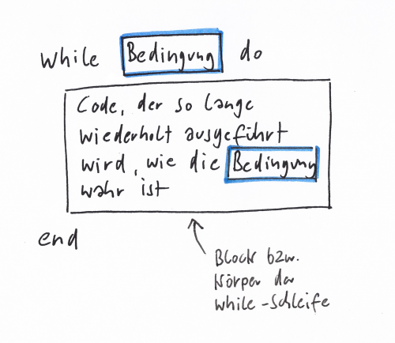
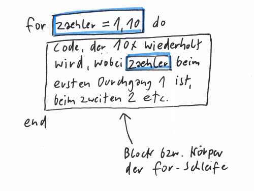

# Programmieren lernen mit Lua: Lektion 03 – Schleifen


<!-- mtoc-start -->

* [Code wiederholen mit `while`](#code-wiederholen-mit-while)
* [Mit `break` aus der Schleife herausspringen](#mit-break-aus-der-schleife-herausspringen)
* [Zahlen addieren bis zur ungültigen Eingabe](#zahlen-addieren-bis-zur-ungueltigen-eingabe)
* [Aufgabe 1.1](#aufgabe-11)
* [Aufgabe 1.2](#aufgabe-12)
* [Aufgabe 2](#aufgabe-2)
* [Code wiederholen mit `for`](#code-wiederholen-mit-for)
* [Aufgabe 3](#aufgabe-3)
* [Aufgabe 4](#aufgabe-4)
* [Verschachtelte `for`-Schleifen: Das kleine Einmaleins](#verschachtelte-for-schleifen-das-kleine-einmaleins)
* [Aufgabe 5](#aufgabe-5)
* [Aufgabe 6](#aufgabe-6)
* [Projekt Mathetrainer](#projekt-mathetrainer)
* [Aufgabe 7](#aufgabe-7)
* [Anregungen zur Erweiterung des Mathetrainers](#anregungen-zur-erweiterung-des-mathetrainers)
* [Was wir hier ausgelassen haben](#was-wir-hier-ausgelassen-haben)

<!-- mtoc-end -->

Stell Dir vor, Du möchtest ein Programm schreiben, das dreimal nach der Eingabe
einer Zahl fragt, und am Ende die Summe aller eingegebenen Zahlen ausgibt. Das
Programm könnte so aussehen:

```lua
summe = 0

print("Bitte gib eine Zahl ein")
eingabe = io.read()
zahl = tonumber(eingabe)
summe = summe + zahl
print("Summe: " .. summe)

print("Bitte gib eine Zahl ein")
eingabe = io.read()
zahl = tonumber(eingabe)
summe = summe + zahl
print("Summe: " .. summe)

print("Bitte gib eine Zahl ein")
eingabe = io.read()
zahl = tonumber(eingabe)
summe = summe + zahl
print("Summe: " .. summe)
```

Das Programm arbeitet zwar wie gewünscht, hat aber diverse Nachteile:

- Im Code werden Anweisungen drei Mal identisch wiederholt
- Wenn Du am Eingabeprocedere etwas ändern willst, dann musst Du an drei
Stellen den Code ändern
- Du bist unflexibel, wenn Du etwa möchtest, dass 5, 9 oder 13 Zahlen
eingegeben werden sollen

Lua bietet drei Kontrollstrukturen an, um identische Anweisungen zu wiederholen:
`while`-und `for`-Schleifen sowie `repeat`. Schauen wir uns zunächst `while` an.


---

## Code wiederholen mit `while`

Mit `while` wiederholst Du Anweisungen so lange, wie eine bestimmte
Bedingung wahr ist.



Das folgende Beispielprogramm wiederholt alle Eingaben wie ein Echo. Das
passiert innerhalb einer Schleife. Die läuft schlichtweg so lange, bis die
Nutzer*in `q` eingegeben hat: `while eingabe ~= "q"`.

Der markierte und eingerückte Code zwischen dem `do` und dem `end` wird
wiederholt. Auch hier sprechen wir – ähnlich wie bei der bedingten Ausführung
in der letzten Lektion – von einem **Block**. Hierbei ist eine Einrückung des
Codes für die Lesbarkeit dringend empfohlen. Der Editor rückt den Code
automatisch beim Ausführen ein.

Wenn die Eingabe gleich `q` ist, springt das Programm aus der `while`-Schleife
(und dem zugehörigen Block) heraus und erreicht die letzte Zeile.

```lua
eingabe = ""

while eingabe ~= "q" do
  eingabe = io.read()
  print(eingabe)
end

print("Du hast das Programm mit 'q' beendet.")
```

Aus Sicht eines Nutzers könnte die Bedienung des Programms so aussehen:

```text
$ dies
dies
$ das
das
$ q
q
Du hast das Programm mit 'q' beendet.
```

---

## Mit `break` aus der Schleife herausspringen

Das folgende Programm verhält sich genau so wie das vorherige. Es arbeitet aber
mit einer **Endlosschleife**: Die Bedingung `true` ist immer wahr. „Endlos“ ist
diese Schleife aber nur im Prinzip: Nach jeder Eingabe wird geprüft, ob die
Eingabe gleich `q` ist. In diesem Fall sorgt das Schlüsselwort `break` für ein
Verlassen der Schleife.

Der Vorteil dieser Variante: Wir müssen die Variable `eingabe` vor Beginn der
Schleife nicht initialisieren.

```lua
while true do
  eingabe = io.read()
  print(eingabe)
  if eingabe == "q" then
    break
  end
end

print("Du hast das Programm mit 'q' beendet.")
```

---

## Zahlen addieren bis zur ungültigen Eingabe

Zurück zu dem am Anfang vorgestellten Beispiel, bei dem eingegebene Zahlen
addiert werden sollen. Mit einer `while`-Schleife lässt sich ein solches
Programm eleganter und flexibler gestalten.

Zur Erinnerung: Die Funktion `tonumber()` versucht, einen String in eine Zahl
umzuwandeln. Gelingt dies nicht, liefert `tonumber()` keine Zahl, sondern
`nil`. Wir können also mit `if zahl` prüfen, ob eine gültige Eingabe gemacht
wurde. In dem Fall addieren wir; sonst brechen wir die Schleife mit `break` ab.

```lua
summe = 0

while true do
  eingabe = io.read()
  zahl = tonumber(eingabe)
  if zahl then
    summe = summe + zahl
    print("Summe: " .. summe)
  else
    break
  end
end

print("Du hast das Programm durch eine ungültige Eingabe beendet.")
```

---

## Aufgabe 1.1

Erweitere das letzte Programmbeispiel: Die Variable `anzahl_eingaben`
soll auf die Anzahl der gültigen Eingaben verweisen. Nach jeder Eingabe
soll nicht nur die Summe, sondern auch die Anzahl der eingegebenen Zahlen
ausgegeben werden.

<details>
<summary>▽ Lösung</summary>

```lua
summe = 0
anzahl_eingaben = 0

while true do
  eingabe = io.read()
  zahl = tonumber(eingabe)
  if zahl then
    summe = summe + zahl
    anzahl_eingaben = anzahl_eingaben + 1
    print("Summe: " .. summe)
    print("Anzahl der Eingaben: " .. anzahl_eingaben)
  else
    break
  end
end

print("Du hast das Programm durch eine ungültige Eingabe beendet.")
```

</details>

---

## Aufgabe 1.2

Erweitere die Lösung von Aufgabe 1.1: Es soll bei jedem Schleifendurchgang
zusätzlich der Durchschnitt (also `summe/anzahl_eingaben`) berechnet und
ausgegeben werden.

<details>
<summary>▽ Lösung</summary>

```lua
summe = 0
anzahl_eingaben = 0

while true do
  eingabe = io.read()
  zahl = tonumber(eingabe)
  if zahl then
    summe = summe + zahl
    anzahl_eingaben = anzahl_eingaben + 1
    durchschnitt = summe / anzahl_eingaben
    print("Summe: " .. summe)
    print("Anzahl der Eingaben: " .. anzahl_eingaben)
    print("Durchschnitt: " .. durchschnitt)
  else
    break
  end
end

print("Du hast das Programm durch eine ungültige Eingabe beendet.")
```

</details>

---

## Aufgabe 2

Schreibe ein Programm, das einen Text per Nutzereingabe in einer
`while`-Schleife zusammensetzt. Mit `q` soll aus der Schleife herausgesprungen
werden:

```text
$ Es
Es
$ war
Es war
$ einmal
Es war einmal
$ q
Ende
```

<details>
<summary>▽ Lösung</summary>

```lua
text = ""
 
while true do
  eingabe = io.read()
 
  if eingabe == "q" then
    break
  else
    text = text  .. eingabe  .. " "
    print(text)
  end
 
end
```
</details>

---

## Code wiederholen mit `for`

Die `while`-Schleife eignet sich vor allem für Situationen, bei denen zu Beginn
der Schleife nicht klar ist, wie oft der Code wiederholt werden soll. Ist die
Anzahl der gewünschten Wiederholungen bekannt, dann ist eine `for`-Schleife
besser geeignet.

Der folgende Codeschnipsel gibt drei Mal hintereinander „Ha“ aus:

```lua
for zaehler = 1, 3 do
  print("Ha")
end
```

`zaehler = 1, 3` sorgt für die dreimalige Wiederholung. Wenn Du die `3` durch
eine `5` ersetzt, wird der Code zwischen `do` und `end` fünf Mal wiederholt.

Du kannst den Zähler auch innerhalb des Blocks der `for`-Schleife verwenden.
Das folgende Beispiel gibt die Zahlen von 1 bis 10 aus. Du kannst statt
`zaehler` auch `x`, `counter`, `index`, `i` (oder was immer Dir beliebt)
schreiben.

```lua
for zaehler = 1, 10 do
  print(zaehler)
end
```

Der Zähler muss nicht bei 1 beginnen. Das folgende Beispiel zählt von 5 bis 10.
Üblich sind zum Beispiel die Bezeichnungen `i` oder `idx` (für Index):

```lua
for idx = 5, 10 do
  print(idx)
end
```

Du hast auch die Möglichkeit, mit einer dritten Zahl eine Schrittweite
anzugeben: `zaehler = 0, 100, 10` geht von 0 nach 100 in Zehnerschritten:

```lua
for zaehler = 0, 100, 10 do
  print(zaehler)
end
```

Die Schrittweite muss keine ganze Zahl sein. So zählst Du von 0 bis 1 in
Zehntelschritten:

```lua
for zaehler = 0, 1, 0.1 do
  print(zaehler)
end
```

Du kannst auch rückwärts zählen. In diesem Fall ist die Schrittweite `-1`:

```lua
for zaehler = 3, -3, -1 do
  print(zaehler)
end
```




Auch für Start- und Endpunkt sowie für die Schrittweite kannst Du
selbstverständlich Variablen einsetzen, zum Beispiel so:

```lua
von = 5
bis = 10
schrittweite = 0.5

for idx = von, bis, schrittweite do
  print(idx)
end
```

---

## Aufgabe 3

Gib die ersten 10 Vielfachen von 7 in einer `for`-Schleife im folgenden Format aus:

```text
1 mal 7 ist 7
2 mal 7 ist 14
3 mal 7 ist 21
...
```

<details>
<summary>▽ Lösung</summary>

```lua
for zahl = 1,10 do
  print(zahl .. " mal 7 ist " .. zahl * 7)
end
```
</details>

---

## Aufgabe 4

Schreibe ein Programm, das die Nutzerin nach Start-, Endpunkt und Schrittweite
fragt und anschließend in einer `for`-Schleife zählt und die Zählerwerte
ausgibt:

```text
Startpunkt
$ 5
Endpunkt
$ 7
Schrittweite
$ 0.5
5
5.5
6
6.5
7
```

<details>
<summary>▽ Lösung</summary>

```lua
print("Startpunkt:")
eingabe = io.read()
von = tonumber(eingabe)

print("Endpunkt:")
eingabe = io.read()
bis = tonumber(eingabe)

print("Schrittweite:")
eingabe = io.read()
schrittweite = tonumber(eingabe)

for idx = von, bis, schrittweite do
  print(idx)
end
```

</details>

Es ist eine nützliche Übung, wenn Du mit der Lösung von Aufgabe 4 verschiedene
Start- und Endpunkte und Schrittweiten ausprobierst.

---

## Verschachtelte `for`-Schleifen: Das kleine Einmaleins

In der Praxis kommt es recht häufig vor, dass der Körper einer `for`-Schleife
wiederum eine `for`-Schleife enthält. Im folgenden Beispiel nutzen wir zwei
solche **ineinander verschachtelte Schleifen**, um das kleine Einmaleins
aufzuzählen:

```lua
for faktor1 = 1, 10 do
  for faktor2 = 1, 10 do
    print(faktor1 .. " mal " .. faktor2 .. " ist " .. faktor1 * faktor2)
  end
end
```

---

## Aufgabe 5

Verändere das letzte Programmbeispiel: Es sollen nur ungerade Zahlen aus dem
Bereich 1–20 miteinander multipliziert werden.

<details>
<summary>▽ Lösung</summary>

```lua
for faktor1 = 1, 20, 2 do
  for faktor2 = 1, 20, 2 do
    print(faktor1 .. " mal " .. faktor2 .. " ist " .. faktor1 * faktor2)
  end
end
```

</details>

---

## Aufgabe 6

Schau Dir die Lösung von Aufgabe 4 noch einmal an. Du kannst dort einmal
Startpunkt, Endpunkt und Schrittweite eingeben und die entsprechende
`for`-Schleife laufen lassen. Erweitere das Programm, damit Du beliebig oft
(Stichwort: Endlosschleife) neue Eingaben probieren kannst.

<details>
<summary>▽ Lösung</summary>

```lua
while true do

  print("Startpunkt:")
  eingabe = io.read()
  von = tonumber(eingabe)

  print("Endpunkt:")
  eingabe = io.read()
  bis = tonumber(eingabe)

  print("Schrittweite:")
  eingabe = io.read()
  schrittweite = tonumber(eingabe)

  for idx = von, bis, schrittweite do
    print(idx)
  end

end
```

</details>

---

## Projekt Mathetrainer

An diesem Punkt haben wir genug über Lua erfahren, um ein erstes umfangreicheres
Programm zu schreiben: einen Mathetrainer. Das Programm soll der Nutzer*in
Rechenaufgaben im Stil von `7 * 8 = ?` stellen. Für richtige Lösungen gibt es
einen Punkt. Nach einer bestimmten Anzahl von Aufgaben soll das Programm die
Trefferquote ausgeben: „Du hast 8 von 10 Aufgaben richtig gelöst.“

Damit das Programm nicht jedes Mal die selben Aufgaben stellt, benötigen wir
Zufallszahlen. Das erledigt `math.random()`. `math` ist eine Erweiterung von
Lua, die mathematische Funktionen bereitstellt. `math.random(1, 10)` liefert
bei jedem Aufruf eine Zufallszahl zwischen 1 und 10.

```lua
punkte = 0
anzahl_aufgaben = 10

for zaehler = 1, anzahl_aufgaben do

  faktor1 = math.random(1, 10)
  faktor2 = math.random(1, 10)

  print(faktor1 .. " * " .. faktor2 .. " = ?")

  eingabe = io.read()
  ergebnis = tonumber(eingabe)

  if ergebnis == faktor1 * faktor2 then
    print("Korrekt!")
    punkte = punkte + 1
  else
    print("Leider falsch!")
  end

end

print("Du hast " .. punkte .. " von " .. anzahl_aufgaben .. " Aufgaben gelöst.")
```

Erklärung (bezogen auf die Zeilen im Programm):

- Wenn `anzahl_aufgaben` gleich 10 ist, dann wird die `for`-Schleife 10 mal wiederholt.
- Ermittlung der beiden Faktoren für die Rechenaufgabe.
- Nutzereingabe und Umwandlung in eine Zahl.
- Wenn die eingegebene Lösung richtig ist …
- … erhöhe die Punktzahl um 1.
- Berechnung und Ausgabe der Erfolgsquote.


---

## Aufgabe 7

Verpacke den Code des Mathetrainers in eine Endlosschleife. Am Ende jedes
Durchgangs soll gefragt werden:

> „Wenn Du noch eine Runde trainieren willst, dann gib ‚ja‘ ein.“

Bei der Eingabe von `ja` startet eine neue Runde, bei jeder anderen Eingabe
soll das Programm aus der Endlosschleife springen und zu Ende sein.

<details>
<summary>▽ Lösung</summary>

```lua
while true do
  punkte = 0
  anzahl_aufgaben = 10

  for zaehler = 1, anzahl_aufgaben do

    faktor1 = math.random(1, 10)
    faktor2 = math.random(1, 10)

    print(faktor1 .. " * " .. faktor2 .. " = ?")

    eingabe = io.read()
    ergebnis = tonumber(eingabe)

    if ergebnis == faktor1 * faktor2 then
      print("Korrekt!")
      punkte = punkte + 1
    else
      print("Leider falsch!")
    end

  end

  print("Du hast " .. punkte .. " von " .. anzahl_aufgaben .. " Aufgaben richtig gelöst.")

  print("Wenn Du noch eine Runde trainieren willst, gib 'ja' ein.")
  eingabe = io.read()
  if eingabe ~= "ja" then
    break
  end

end
```

</details>

---

## Anregungen zur Erweiterung des Mathetrainers

Es gibt viele Möglichkeiten, den Mathetrainer zu erweitern:

- Anstatt das Programm auf den Zahlenbereich 1 bis 10 festzulegen, könntest Du
einen Variablen `maxFaktor` anlegen, der die obere Grenze bestimmt. Dann
könntest Du etwa das sogenannte große Einmaleins trainieren, das die Zahlen von
1 bis 20 miteinander multipliziert.
- Noch kniffliger wird es, wenn Du Aufgaben stellst, bei denen drei Zahlen
miteinander multipliziert werden sollen: `3 * 7 * 9 = ?`
- Du könntest am Ende des Programms nicht nur die absolute Zahl der richtigen
Antworten nennen, sondern das Verhältnis zwischen richtigen und falschen
Antworten berechnen und ausgeben (z. B. Trefferquote).
- Abhängig von diesem Verhältnis könntest Du per `if ... elseif` ein Feedback
geben: Wenn weniger als die Hälfte aller Aufgaben richtig gelöst wurden: „Du
solltest mehr üben“ etc.

---

## Was wir hier ausgelassen haben

Einen in bestimmten Situationen wesentlichen Punkt, den wir hier ausgelassen
haben: Auch `for`-Schleifen lassen sich per `break` vorzeitig beenden. Probiere
es selbst aus!

Ein weiteres wichtiges Thema im Zusammenhang mit `for`-Schleifen: Auch
zusammengesetzte Datentypen (in Lua sind das eigentlich immer Tabellen) lassen
sich mit `for`-Schleifen durchlaufen. Wenn etwa eine Tabelle eine Liste mit
Zahlen enthält, dann könnte man diese per `for`-Schleife aufzählen. Das zeigen
wir in Lektion 5.
