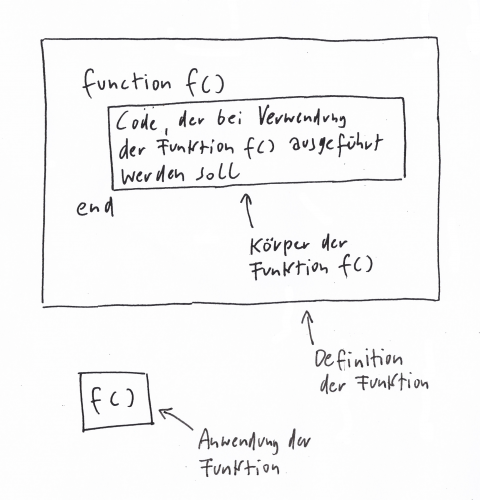

# Lua – Funktionen (Lektion)


<!-- mtoc-start -->

* [Funktionsaufruf: Name + Klammern + Argumente](#funktionsaufruf-name--klammern--argumente)
* [Eine Pizzeria programmieren](#eine-pizzeria-programmieren)
* [Die Pizza per Funktion zubereiten](#die-pizza-per-funktion-zubereiten)
* [Aufgabe 1](#aufgabe-1)
* [Funktionen rufen Funktionen auf](#funktionen-rufen-funktionen-auf)
* [Aufgabe 2](#aufgabe-2)
* [Die Pizzafunktion um ein Argument erweitern](#die-pizzafunktion-um-ein-argument-erweitern)
  * [Aufruf ohne Argument → Fehler](#aufruf-ohne-argument--fehler)
* [Aufgabe 3](#aufgabe-3)
* [Aufgabe 4](#aufgabe-4)
* [Funktionen mit Rückgabewert](#funktionen-mit-rueckgabewert)
* [Die Funktion `plus_sieben`](#die-funktion-plus_sieben)
* [Aufgabe 5](#aufgabe-5)
* [Aufgabe 6](#aufgabe-6)
* [Aufgabe 7](#aufgabe-7)
* [Mehrere `return`s in einer Funktion: `begrenze`](#mehrere-returns-in-einer-funktion-begrenze)
* [`return` statt `break`](#return-statt-break)
* [Aufgabe 8 (für Fortgeschrittene)](#aufgabe-8-fuer-fortgeschrittene)
* [Ausblick: Themen, die wir ausgelassen haben](#ausblick-themen-die-wir-ausgelassen-haben)
  * [Mehrere Rückgabewerte](#mehrere-rueckgabewerte)
  * [Rekursion (Selbstaufruf)](#rekursion-selbstaufruf)
  * [Funktionen als Werte (und „Abkürzung“ bei Funktionsdefinitionen)](#funktionen-als-werte-und-abkuerzung-bei-funktionsdefinitionen)

<!-- mtoc-end -->

Wir haben bereits ab der ersten Lektion Funktionen verwendet:

- `print()`
- `type()`
- `io.read()`
- `tonumber()`
- `math.random()`

Du kannst Dir eine Funktion, die sich wiederholende Anweisungen zusammenfasst.
Genau so gut und richtig ist die Idee, eine Funktion als ein Unterprogramm zu
sehen, das auf eine bestimmte Aufgabe spezialisiert ist. Anstatt an jeder
Stelle den kompletten Code hinzuschreiben, wo dieser benötig wird, kannst Du
diesen Code in eine Funktion verpacken und diese Funktion dann an beliebigen Stellen in
Deinem Programm verwenden.

Die Verwendung einer Funktion wird oft **Funktionsaufruf** genannt. Ein
Funktionsaufruf besteht aus dem Namen der Funktion und einem Paar
runder Klammern. Zwischen den Klammern stehen oft ein oder mehrere
**Argumente**. Argumente sind Werte, welche zur Ausführung der Funktion
benötigt werden.

---

## Funktionsaufruf: Name + Klammern + Argumente

```lua
print("guten tag")
```

Ausgabe:

```
guten tag
```

In diesem Fall ist der Name der Funktion `print()`. Das Argument ist der String
`"guten tag"`.

Manche Funktionen können auch mehrere Argumente verarbeiten, das gilt auch für
`print()`:

```lua
print("dies", "das", "jenes")
```

Ausgabe:

```
dies das jenes
```

Andere Funktionen benötigen kein Argument, zum Beispiel `io.read()`. Die runden
Klammern gehören trotzdem immer zum Funktionsaufruf:

```lua
eingabe = io.read()
```

Die runden Klammern unterscheiden den Funktionsaufruf von der Funktion selbst:

```lua
type(print)    -- "function"
type(print())  -- "nil"
```

`io.read()` ist eine Funktion, die einen Wert zurückliefert.

---

## Eine Pizzeria programmieren

Stell Dir vor, Du möchtest ein Textadventure programmieren, in dem es um den
Betrieb einer Pizzeria geht. Jedes Mal, wenn ein Kunde eine 🍕 bestellt,
soll das Programm den Arbeitsablauf der Zubereitung beschreiben. Eine erste
Variante könnte so aussehen:

```lua
print("Teig ausrollen")
print("Tomatensoße hinzu")
print("geriebenen Käse hinzu")
print("backen")
```

---

## Die Pizza per Funktion zubereiten

Aus diesen Anweisungen wird eine Funktion:

```lua
function pizza_backen()
  print("Teig ausrollen")
  print("Tomatensoße hinzu")
  print("geriebenen Käse hinzu")
  print("backen")
end
```

- `function` bedeutet: hier kommt eine Funktionsdefinition.
- `pizza_backen` ist der Name der Funktion.
- Die leeren runden Klammern `()` zeigen: keine Argumente.
- Bis zum `end` steht der Code, der beim Aufruf ausgeführt wird (der **Funktionskörper**).



Wenn Du das Beispiel ausführst, passiert erst einmal nichts: Du hast nur
definiert. Ein Rezept ist noch keine Pizza! Zum Verwenden:

```lua
pizza_backen()
```

---

## Aufgabe 1

Schreibe eine eigene Funktion `tee_kochen()`, welche die Zubereitungsschritte
einer Tasse Tee in den drei Schritten „Wasser kochen“, „Teebeutel in Tasse
hängen“ und „Wasser aufgießen“ nach dem Muster unserer Pizza-Funktion
beschreibt. Führe die Funktion drei Mal aus.

<details>
<summary>▽ Lösung</summary>

```lua
function tee_kochen()
  print("Wasser kochen")
  print("Teebeutel in Tasse hängen")
  print("Wasser aufgießen")
end
 
tee_kochen()
tee_kochen()
tee_kochen()
```

</details>

---

## Funktionen rufen Funktionen auf

Code innerhalb einer Funktion kann wiederum andere Funktionen aufrufen (z. B.
`print()`). Selbst geschriebene Funktionen können auch andere selbst
geschriebene Funktionen aufrufen. Bei größeren Programmen zerlegt man Aufgaben
oft in viele kleine, gut verständliche Funktionen.

---

## Aufgabe 2

Schreibe eine Funktion `teig_zubereiten()`, welche die Beschreibung der
Zubereitung eines Pizza-Teiges ausgibt:

- Wasser, Mehl, Hefe, Öl und Salz in Schüssel geben
- Zutaten rühren
- Teig gehen lassen

Rufe diese Funktion innerhalb der Funktion `pizza_backen()` auf, bevor der Teig
ausgerollt wird.

<details>
<summary>▽ Lösung</summary>

```lua
function teig_zubereiten()
  print("Wasser, Mehl, Hefe, Öl und Salz in Schüssel geben")
  print("Zutaten rühren")
  print("Den Teig gehen lassen")
end
 
function pizza_backen()
  teig_zubereiten()
  print("Teig ausrollen")
  print("Tomatensoße hinzu")
  print("geriebenen Käse hinzu")
  print("backen")
end
```

</details>

---

## Die Pizzafunktion um ein Argument erweitern

Statt für jede Sorte fast denselben Code zu schreiben, fassen wir die
Unterschiede zusammen – mit einem Argument `extrabelag`:

```lua
function pizza_backen(extrabelag)
  print("Teig ausrollen")
  print("Tomatensoße hinzu")
  print(extrabelag .. " hinzu")
  print("geriebenen Käse hinzu")
  print("backen")
end
```

Aufrufe:

```lua
pizza_backen("Pilze")
pizza_backen("Spiegelei")
pizza_backen("Vanilleeis")
```

### Aufruf ohne Argument → Fehler

Wenn diese Funktine ohne Argument aufgerufen werden, ist `extrabelag` gleich `nil`, und dann
klappt `extrabelag .. " hinzu"` nicht:

```lua
pizza_backen()
-- attempt to concatenate local 'extrabelag' (a nil value)
```

---

## Aufgabe 3

Wie können wir den Fehler verhindern, wenn jemand eine einfache Margherita ohne
Extrabelag wünscht?

Tipps: Du brauchst `if`, und `nil` wird wie `false` bewertet.

<details>
<summary>▽ Lösung</summary>

```lua
function pizza_backen(extrabelag)
  print("Teig ausrollen")
  print("Tomatensoße hinzu")
  if extrabelag then
    print(extrabelag .. " hinzu")
  end
  print("geriebenen Käse hinzu")
  print("backen")
end
```
</details>

---

## Aufgabe 4

Schreibe eine Funktion, die **zwei** Extrabeläge auf die Pizza bringen kann.
Hinweis: mehrere Argumente werden mit Kommas getrennt.

<details>
<summary>▽ Lösung</summary>

```lua
function pizza_backen(extrabelag, extrabelag2)
  print("Teig ausrollen")
  print("Tomatensoße hinzu")
  if extrabelag then
    print(extrabelag .. " hinzu")
  end
  if extrabelag2 then
    print(extrabelag2 .. " hinzu")
  end
  print("geriebenen Käse hinzu")
  print("backen")
end
```

</details>

---

## Funktionen mit Rückgabewert

Zwei grobe Kategorien:

1. Funktionen, welche etwas machen (z. B. `print()`).
2. Funktionen, welche einen Wert (Ergebnis) zurückliefern (z. B. `type()`, `tonumber()`).

Beispiele:

```lua
type(10)            -- "number"
tonumber("42")      -- 42
tonumber("sieben")  -- nil
```

---

## Die Funktion `plus_sieben`

Die Funktion `plus_sieben` liefert mit dem Schlüsselwort `return` ein Ergebnis
zurück. 

```lua
function plus_sieben(x)
  return x + 7
end
```

Beispiele:

```lua
plus_sieben(3)   -- 10
plus_sieben(7)   -- 14
plus_sieben(-5)  -- 2
```

---

## Aufgabe 5

Schreibe nach dem Muster von `plus_sieben()` folgende Funktionen und teste diese:

- `plus_drei()`
- `minus_fuenf()`
- `mal_zehn()`
- `geteilt_durch_drei()`

<details>
<summary>▽ Lösung</summary>

```lua
function plus_drei(x)
  return x + 3
end
 
function minus_fuenf(x)
  return x - 5
end
 
function mal_zehn(x)
  return x * 10
end
 
function geteilt_durch_drei(x)
  return x / 3
end
```

</details>

---

## Aufgabe 6

Schreibe eine Funktion, welche `true` zurückliefert, wenn das Argument `x` eine
Zahl ist (`type(x) == "number"`), sonst `false`. Teste die Funktion.

<details>
<summary>▽ Lösung</summary>

```lua
function ist_zahl(x)
  return type(x) == "number"
end
```

Anmerkung: Anfänger tendieren oft dazu, diese Lösung mit einem wesentlich
komplizierteren Konstrukt in folgender Art zu lösen:

```lua
if type(x) == "number" then
  return true
else
  return false
end
```

Das ist zwar nicht falsch, aber zu umständlich. type(x) == "number" ist ja
bereits das, was wir wissen und zurückliefern wollen.


</details>

---

## Aufgabe 7

Schreibe eine Funktion `ist_dazwischen(wert, von, bis)`, welche `true` zurückgibt,
wenn `wert` genau zwischen `von` und `bis` ist, sonst `false`.

<details>
<summary>▽ Lösung (Platzhalter)</summary>

```lua
function ist_dazwischen(wert, von, bis)
  return wert > von and wert < bis
end
```

</details>

---

## Mehrere `return`s in einer Funktion: `begrenze`

```lua
function begrenze(wert, von, bis)

  if wert < von then
    return von
  end

  if wert > bis then
    return bis
  end

  return wert

end
```

Beispiele:

```lua
begrenze(5, 0, 10)    -- 5
begrenze(-3, 0, 10)   -- 0
begrenze(20, 0, 10)   -- 10
```

---

## `return` statt `break`

`break` verlässt eine Schleife, `return` verlässt eine Funktion. Beispiel:

```lua
function wuerfel_bis_sechs()

  while true do
    zahl = math.random(6)
    print(zahl)

    if zahl == 6 then
      break
    end
  end

end
```

---

## Aufgabe 8 (für Fortgeschrittene)

Schreibe eine Funktion `zahl_eingeben()`. Diese soll ungültige Eingaben (welche sich
nicht mit `tonumber()` in eine Zahl umwandeln lassen) abfangen und so lange
nachfragen, bis eine gültige Zahl eingegeben wurde. Diese soll dann als Zahl
zurückgeliefert werden.

<details>
<summary>▽ Lösung</summary>

```lua
function zahl_eingeben()
 
  while true do
    print("Bitte gib eine Zahl ein.")
    eingabe = io.read()
    zahl = tonumber(eingabe)
 
    if zahl then
      return zahl
    else
      print(eingabe .. " kann ich nicht als Zahl interpretieren.")
    end
  end
   
end
 
x = zahl_eingeben()
 
print("Du hast " .. x .. " eingegeben.")
```

</details>

---

## Ausblick: Themen, die wir ausgelassen haben

### Mehrere Rückgabewerte

```lua
function mehrere()
  return 1, 2, 3
end

a, b, c = mehrere()
```

### Rekursion (Selbstaufruf)

```lua
function selbstaufrufer()
  selbstaufrufer()
end
```

### Funktionen als Werte (und „Abkürzung“ bei Funktionsdefinitionen)

```lua
drucke = print
drucke("hallo")
```

Diese Schreibeweise …

```lua
function gruss()
  print("guten tag!")
end
```

entspricht eigentlich dieser Zuweisung.

```lua
gruss = function()
  print("guten tag!")
end
```

Funktionen können daher auch als Argumente übergeben oder als Rückgabewerte
zurückgegeben werden (Funktionen zweiter Ordnung) – ein Thema für
Fortgeschrittene.
