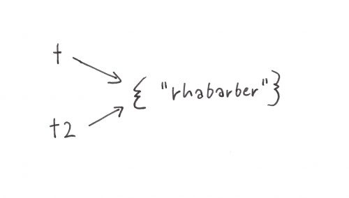

# Lua Lektion 05 a: Tabellen als Listen und Wörterbücher

<!-- mtoc-start -->

* [Tabellen als Listen oder Arrays](#tabellen-als-listen-oder-arrays)
* [Exkurs: Tabellen sind veränderlich](#exkurs-tabellen-sind-veraenderlich)
* [Die Anzahl der Elemente](#die-anzahl-der-elemente)
* [Den Inhalt von listenartigen Tabellen aufzählen](#den-inhalt-von-listenartigen-tabellen-aufzaehlen)
* [Elemente hinzufügen mit `table.insert()`](#elemente-hinzufuegen-mit-tableinsert)
* [Elemente entfernen mit `table.remove()`](#elemente-entfernen-mit-tableremove)
* [Eine Tabelle als Wörterbuch](#eine-tabelle-als-woerterbuch)
* [Beispiel: Einfaches Übersetzungsprogramm](#beispiel-einfaches-uebersetzungsprogramm)
* [Tabelleninhalte durchlaufen mit `pairs()`](#tabelleninhalte-durchlaufen-mit-pairs)

<!-- mtoc-end -->


Die fünfte und letzte Lektion unserer kleinen Lua-Einführung behandelt das
Thema **Tabellen**. Dieses Thema ist besonders spannend und vielseitig.
Tatsächlich wurde die Programmiersprache Lua überhaupt entwickelt, um mit
tabellenartigen Daten besonders flexibel umgehen zu können. Wegen des großen
Umfangs haben wir die Lektion in zwei Teile (**a** und **b**) aufgeteilt.

Tabellen sind das **Schweizer Taschenmesser** unter den Lua-Datentypen. Die
möglichen Anwendungsfälle sind unüberschaubar vielfältig. So können sie
verwendet werden, um etwa folgende Dinge zu speichern und in eurem Programm zu
repräsentieren:

- Der Inhalt einer Tasche
- Alle in einer Physiksimulation umherfliegenden Partikel
- Alle in einer Pizzeria-Simulation vorhandenen Extra-Beläge
- Alle Funktionen, die für eine Pizzeria-Simulation benötigt werden
- Die Eigenschaften eines Bausteins in Minetest (Variante von Minecraft)
- Eine Spielerin mit Eigenschaften wie `name`, `punktestand`, `position` etc.
- Alle Funktionen, die das Verhalten der Spielerin steuern, z. B. `kaempfen()`
oder `position_wechseln()`

---

## Tabellen als Listen oder Arrays

Starten wir mit dem einfachsten Anwendungsfall: Eine Tabelle kann sich wie eine
**Liste von Werten** verhalten. So können wir den Inhalt einer Tasche wie folgt
als Tabelle darstellen:

```lua
tasche = {"buch", "brille", "kekse"}
```

`tasche` ist vom Typ `table`:

```lua
print(type(tasche)) --table
```

Der Zugriff auf die einzelnen Elemente läuft wie folgt:

```lua
print(tasche[1]) -- buch
print(tasche[2]) -- brille
print(tasche[3]) -- kekse
```

Die Zahlen 1, 2, 3 nennen wir hier **Indizes** (Einzahl: Index). Unter dem
Index `1` ist der String `"buch"` gespeichert.

Wenn Du ein nicht existierendes Element abfragst, erhältst Du `nil`. Wie in dem
folgenden Fall – unter dem Index 4 ist nichts gespeichert:

```lua
print(tasche[4]) -- nil
```

Lua verhält sich hier genauso wie bei Variablen, welche auf nichts verweisen.
Zur Erinnerung: `nil` steht für „nihil“ (lateinisch für „Nichts“). `nil` ist
der universelle Platzhalter für Variablen, denen kein Wert zugewiesen ist.

Du kannst nachträglich ein Element hinzufügen:

```lua
 tasche[4] = "bleistift"
```

Jetzt befindet sich an der vierten Position der Liste nicht mehr `nil`, sondern
der String `"bleistift"`:

```lua
print(tasche[4])
```

Genauso kannst Du ein Element durch ein anderes ersetzen. Nach der Ausführung
wurden die Kekse durch einen Apfel ersetzt:

```lua
print(tasche[3] = "apfel")
```

---

## Exkurs: Tabellen sind veränderlich

Die letzten Beispiele zeigen: Tabellen sind im Unterschied zu allen anderen
Typen in der Programmiersprache Lua **veränderlich**.

Wenn Du eine Tabelle `t` anlegst …

```lua
t = {"rhabarber"}
print(t[1])
```

… und einer Variablen `t2` die Tabelle `t` zuweist …

```lua
t2 = t
```

… und dann `t2` veränderst …

```text
t2[1] = "rhododendron"
```

… ist auch die Tabelle `t` verändert:

```lua
print(t[1])
rhododendron
```


Dieses auf den ersten Blick seltsame Verhalten ist auf den zweiten Blick sehr
logisch: `t` und `t2` sind hier Variablen, die auf denselben Wert verweisen.
Daher werden Veränderungen an der Tabelle über beide Variablen sichtbar – es
gibt schlichtweg nur **eine** Tabelle.



Die Variablen `t` und `t2` verweisen beide auf dieselbe Tabelle.

---

## Die Anzahl der Elemente

Zurück zu den „listenartigen“ Tabellen: Ein vorangestelltes `#` liefert die
Anzahl der enthaltenen Elemente:

```lua
print(#tasche)
```

Mithilfe dieses Tricks kannst Du Elemente an die jeweils letzte Position
anhängen. Wenn `tasche` 4 Elemente enthält, dann ist `#tasche + 1` gleich 5,
also die erste freie Position:

```lua
tasche[#tasche + 1] = "block"
tasche[#tasche + 1] = "mineralwasser"

print(#tasche)

print(tasche[5])
print(tasche[6])
```

Es ist übrigens nicht verboten, folgende Dinge zu tun, z. B. den Index 1000 zu
benutzen, auch wenn die Indizes von 7 bis 999 frei sind:

```lua
liste[1000] = "portemonnaie"
```

Auch negative Indizes, hier `-1000`, sind erlaubt:

```lua
liste[-1000] = "kühlakku"
```

Allerdings liefert `#tasche` danach immer noch `6`, obwohl jetzt eigentlich 8
Sachen in der Tasche sind:

```text
print(#tasche)
```

Es ist sogar möglich, statt ganzer Zahlen auch Dezimalzahlen, Strings oder gar
andere Tabellen als Schlüssel zu verwenden. Diese „Tricks“ werden in anderen
Situationen sehr viel Sinn ergeben – **nicht** aber, wenn es um listenartige
Tabellen geht.

Listenartige Tabellen haben folgende Eigenschaften:

- Alle Indizes sind positive ganze Zahlen
- Der niedrigste Index ist `1`
- Es gibt keine „Lücken“: Wenn unter den Indizes `3` und `5` etwas gespeichert
ist, dann muss auch unter `4` etwas gespeichert sein.

Übrigens wird sowohl in der englischsprachigen als auch in der deutschen
Lua-Literatur gelegentlich von „array-like“ bzw. „array-artigen“ Tabellen
gesprochen. Wir verwenden hier den Begriff **Liste**, meinen aber dasselbe.

---

## Den Inhalt von listenartigen Tabellen aufzählen

Zur Erinnerung: In Lektion 03 haben wir gezeigt, wie wir in einer
`for`-Schleife einen Wertebereich durchlaufen. So läuft in der folgenden
Schleife der Index von 1 bis 10 und gibt entsprechend die Zahlen von 1 bis 10
aus:

```lua
for index = 1, 10 do
  print(index)
end
```

Wir können mittels einer `for`-Schleife auch den Inhalt einer listenartigen
Tabelle aufzählen. In unserem konkreten Fall der Tasche ersetzen wir

- `index = 1, 10`

durch

- `index, wert in ipairs(tasche)`

Ihr könnt euch vorstellen, dass `ipairs(tasche)` in jedem Durchgang der
`for`-Schleife einen Eintrag in die Schleife einspeist. Jeder Eintrag besteht
aus einem Index (z. B. `1`) und einem Wert (z. B. `"buch"`). Über die Variablen
`index` und `wert` können wir im Schleifenkörper darauf zugreifen.

Im folgenden durchlaufen wir sämtliche Einträge in der Tabelle `tasche`:

```lua
tasche = {"buch", "brille", "stift"}

for index, wert in ipairs(tasche) do
  print(index .. ": " .. wert)
end
```

Die Ausgabe des Programms sieht so aus:

```text
1: buch
2: brille
3: stift
```

---

### Aufgabe 1.1

Schreibe ein Programm, bei dem die Nutzerin in einer Schleife gefragt wird, was
sie in die Tasche tun möchte. Diese Eingaben sollen in einer Tabelle `tasche`
eingetragen werden. Nach jedem Durchgang der Schleife soll angegeben werden,
wie viele Elemente bereits in der Tasche sind:

```text
Was möchtest Du in die Tasche tun?
> Kartoffeln
Anzahl der Elemente in der Tasche: 1
Was möchtest Du in die Tasche tun?
> Quark
Anzahl der Elemente in der Tasche: 2
```

<details>
<summary>▽ Lösung</summary>

```lua
tasche = {}

while true do
  print("Was möchtest Du in die Tasche tun?")
  eingabe = io.read()
  tasche[#tasche + 1] = eingabe
  print("Anzahl der Elemente in der Tasche: " .. #tasche)
end
```

</details>

---

### Aufgabe 1.2

Erweitere die Lösung von Aufgabe 1.1, sodass nach jeder Eingabe nicht mehr die
Anzahl der Elemente genannt, sondern alle Elemente aufgezählt werden:

```text
Was möchtest Du in die Tasche tun?
> Schraubendreher
In der Tasche befinden sich:
Schraubendreher
Was möchtest Du in die Tasche tun?
> Hammer
In der Tasche befinden sich:
Schraubendreher
Hammer
```

<details>
<summary>▽ Lösung</summary>

```lua
tasche = {}

while true do

  print("Was möchtest Du in die Tasche tun?")
  eingabe = io.read()
  tasche[#tasche + 1] = eingabe

  print("In der Tasche befinden sich:")
  for index, wert in ipairs(tasche) do
    print(wert)
  end

end
```

</details>

---

### Aufgabe 1.3

Erweitere die Lösung von Aufgabe 1.2: Es sollen maximal 5 Sachen in die Tasche
passen. Die Aufzählung soll erst erfolgen, wenn die Tasche voll ist. Löse die
Aufgabe mit einer Abfrage innerhalb der `while`-Schleife und `break`.

Beispiel:

```text
Was möchtest Du in die Tasche tun?
> Zitronen
Was möchtest Du in die Tasche tun?
> Orangen
...
Die Tasche ist nun voll und enthält:
Zitronen
Orangen
...
```

<details>
<summary>▽ Lösung</summary>
Hier die Lösung rein.
</details>

---

## Elemente hinzufügen mit `table.insert()`

Wir haben bereits gezeigt, wie sich ein Element an das Ende einer listenartigen
Tabelle anhängen lässt:

```lua
tabelle[#tabelle + 1] = x
```

Was ist aber, wenn die Reihenfolge (z. B. bei einem Ranking von
Lieblingsserien) eine Rolle spielt und wir an einer anderen Stelle – am Anfang
oder mitten drin – ein Element einfügen wollen?

Wir könnten das „von Hand“ machen, indem wir alle Elemente nach dem
Einfügepunkt um einen Schritt nach hinten verschieben:

```lua
lieblingsserien = {"Fargo", "The Prisoner", "Better call Saul"}
```

Ein Einfügen an der ersten Position würde dann so aussehen:

```lua
lieblingsserien[4] = lieblingsserien[3]
lieblingsserien[3] = lieblingsserien[3]
lieblingsserien[2] = lieblingsserien[1]
lieblingsserien[1] = "WandaVision"
```

Das ist mühsam. Zum Glück erleichtert uns Lua die Aufgabe mit der Funktion
`table.insert()`. `table` ist eine Bibliothek mit Funktionen, die sich auf
Tabellen anwenden lassen.

`table.insert()` erwartet drei Argumente:

```lua
table.insert(tabelle, position, wert)
```

- `tabelle`: Die Tabelle, in die etwas eingefügt werden soll
- `position`: Die Position, an der etwas eingefügt werden soll
- `wert`: Das, was eingefügt werden soll

Das nächste Beispiel zeigt die Anwendung. In diesen und den folgenden
Beispielen verwenden wir zudem eine selbst definierte Funktion
`zeige_inhalt()`, die den Inhalt einer Tabelle ausgibt.

```lua
function zeige_inhalt(tabelle)
  for index, wert in ipairs(tabelle) do
    print(index .. ": " .. wert)
  end
end

lieblingsserien = {"Fargo", "The Prisoner", "Better call Saul"}
table.insert(lieblingsserien, 1, "WandaVision")
zeige_inhalt(lieblingsserien)
```

Die Ausgabe sieht so aus:

```text
1: WandaVision
2: Fargo
3: The Prisoner
4: Better call Saul
```

---

## Elemente entfernen mit `table.remove()`

Wir können Elemente aus einer Tabelle entfernen, indem wir ihnen `nil`
zuweisen. Das bringt bei listenartigen Tabellen aber Probleme mit sich:

```lua
aufgaben = {"Abwaschen", "Müll runterbringen", "Regale abstauben", "Saugen"}
aufgaben[2] = nil
```

Wenn wir jetzt die Tabelle `aufgaben` mit `for` und `ipairs()` durchlaufen,
bricht die Aufzählung bereits nach dem ersten Element ab:

```text
1: Abwaschen
```

Das liegt daran, dass durch das „Löschen“ der zweiten Position die Tabelle
nicht mehr lückenlos ist. Die Schleife bricht an der ersten Position ab, die
`nil` ist.

Auch hier könnten wir das Problem durch mühsames Verschieben der nachfolgenden
Elemente lösen. Lua bietet eine vereinfachte Lösung: `table.remove()`. Die
Funktion erwartet zwei Argumente: die Tabelle und den Index des zu entfernenden
Elements.

```lua
aufgaben = {"Abwaschen", "Müll runterbringen", "Regale abstauben", "Saugen"}
table.remove(aufgaben, 2)
zeige_inhalt(aufgaben)
```

Jetzt sind die Elemente nach der entfernten Position um 1 aufgerückt:

```text
1: Abwaschen
2: Regale abstauben
3: Saugen
```

---

### Aufgabe 2.1

Du hast eine Tabelle mit den Namen von Geburtstagsgästen:

```lua
gaeste = {"Anna", "Peter", "Michael", "Sabine", "Michaela"}
```

Mit welchem Code fügst Du an der ersten Stelle den Gast „Theodor“ ein?

<details>
<summary>▽ Lösung</summary>

```lua
table.insert(gaeste, 1, "theodor")
```

</details>

---

### Aufgabe 2.2

Michael hat abgesagt und Du möchtest ihn von der Liste streichen. Anstatt
mühsam von Hand die entsprechende Position (bzw. den Index) zu ermitteln,
schreibe Code, welcher die Position automatisch ermittelt und dann das
entsprechende Element entfernt.

Tipps:

- Du benötigst dafür `for` und `ipairs()`
- Nutze, dass `ipairs()` sowohl den Index als auch den Wert an die Schleife liefert
- Wenn in einem Schleifendurchgang `wert == "Michael"` gilt, kannst Du den Index für `table.remove(...)` verwenden

<details>
<summary>▽ Lösung</summary>

```lua
gaeste = {"Anna", "Peter", "Michael", "Sabine", "Maria"}

for index, wert in ipairs(gaeste) do
  if wert == "Michael" then
    table.remove(gaeste, index)
  end
end
```

</details>

Die Ausgabe sieht so aus, Michael steht nicht mehr in der Liste:

```text
1: Anna
2: Peter
3: Sabine
4: Maria
```

---

## Eine Tabelle als Wörterbuch

Im vorherigen Abschnitt haben wir uns mit listenartigen Tabellen beschäftigt.
Eine wichtige Eigenschaft listenartiger Tabellen ist, dass die Indizes
(allgemeiner: Schlüssel) positive ganze Zahlen sind. Das muss aber nicht sein.

Im folgenden Beispiel sind die Schlüssel vom Datentyp *String*. Eine Tabelle
speichert englische Übersetzungen einiger deutscher Wörter:

```lua
woerterbuch = {}
woerterbuch["sonne"] = "sun"
woerterbuch["stern"] = "star"
woerterbuch["erde"] = "earth"
```

Wenn Schlüssel vom Datentyp String ohne Leerzeichen sind, dann gilt folgende
verkürzte Schreibweise:

```lua
> woerterbuch.sonne = "sun"
> woerterbuch.stern = "star"
> woerterbuch.erde = "earth"
```

Anstatt die Tabelle schrittweise zu befüllen, kannst Du die Tabelle auch in einem Schritt definieren (Literal-Schreibweise):

```lua
woerterbuch = {
  sonne = "sun",
  stern = "star",
  erde = "earth"
}
```

Die Abfrage der einzelnen Einträge läuft entsprechend:

```lua
print(woerterbuch["sonne"])
```

Oder in Kurzschreibweise:

```lua
print(woerterbuch.sonne)
```

---

## Beispiel: Einfaches Übersetzungsprogramm

Das folgende Programmbeispiel ist ein einfaches Übersetzungsprogramm, bei dem
die Nutzerin ein deutsches Wort eingibt, um die englische Übersetzung zu
erhalten. Gibt es zu dem eingegebenen deutschen Wort keinen Eintrag, liefert
das Programm eine entsprechende Meldung.

```lua
woerterbuch = {
  sonne = "sun",
  stern = "star",
  erde = "earth"
}

while true do

  print("Bitte gib ein Wort ein.")
  eingabe = io.read()
  uebersetzung = woerterbuch[eingabe]

  if uebersetzung then
    print(uebersetzung)
  else
    print("Das Wort " .. eingabe .. " ist mir unbekannt")
  end

end
```

Erklärung:

- `woerterbuch[eingabe]` liefert den Eintrag (falls vorhanden), sonst `nil`.  
  **Obacht:** Die Kurzschreibweise `woerterbuch.eingabe` ist hier nicht möglich, weil das vom Lua-Interpreter als `woerterbuch["eingabe"]` verarbeitet würde.
- Nur wenn `uebersetzung` nicht `nil` ist …
- … gibt das Programm die Übersetzung aus …
- … andernfalls meldet das Programm, dass das Wort unbekannt ist.


---

### Aufgabe 3

Erweitere das letzte Programmbeispiel, sodass es neue Wörter lernen kann. Wenn
ein Wort unbekannt ist, soll das Programm nach einer Übersetzung fragen und
diese in die Tabelle `woerterbuch` eintragen. Teste das Programm auf der
Konsole. Es soll folgendes Verhalten zeigen:

```text
Bitte gib ein Wort ein.
> buch
Das Wort 'buch' ist mir unbekannt. Bitte gib eine Übersetzung ein.
> book
Bitte gib ein Wort ein.
> buch
book
```

<details>
<summary>▽ Lösung</summary>

```lua
woerterbuch = {
  sonne = "sun",
  stern = "star",
  erde = "earth"
}

while true do

  print("Bitte gib ein Wort ein.")
  eingabe = io.read()
  uebersetzung = woerterbuch[eingabe]

  if uebersetzung then
    print(uebersetzung)
  else
    print("Das Wort '" .. eingabe .. "' ist mir unbekannt. Bitte gib eine Übersetzung ein.")
    uebersetzung = io.read()
    woerterbuch[eingabe] = uebersetzung
  end

end
```

</details>

---

## Tabelleninhalte durchlaufen mit `pairs()`

Listenartige Tabellen können wir mit `ipairs()` durchlaufen. Die Funktion
`pairs()` ist die allgemeinere Variante. Sie funktioniert für jede Art von
Schlüssel:

```lua
woerterbuch = {
  sonne = "sun",
  stern = "star",
  erde = "earth"
}

for deutsch, englisch in pairs(woerterbuch) do
  print(deutsch .. ": " .. englisch)
end
```
